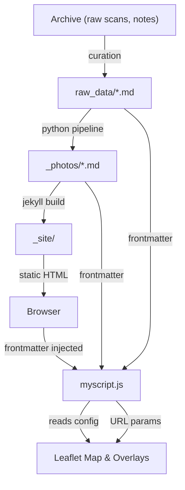
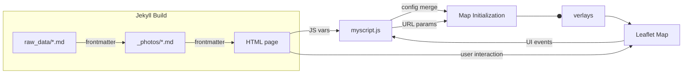
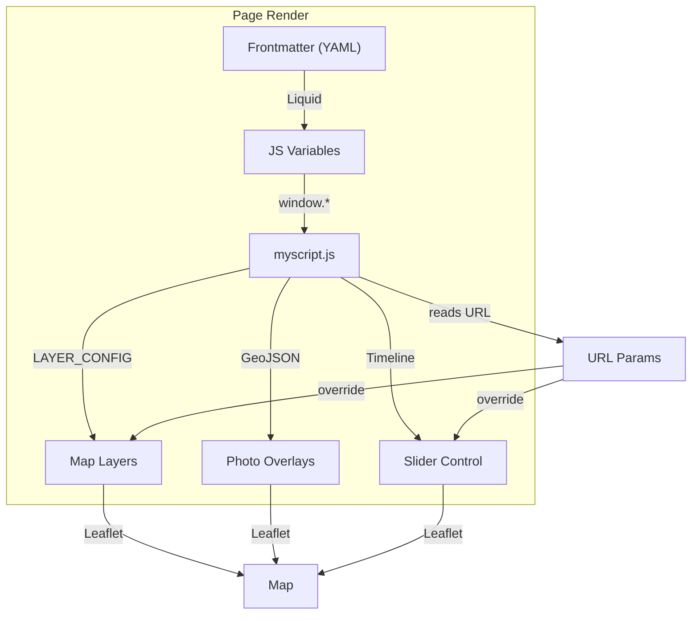

## Overview



Historical material is first collected from archival scans, social-history contributions, and manual research notes, then normalized by an editor into one Markdown file per photo object inside `raw_data/`.
Each `raw_data` entry represents a single historical record: descriptive text + structured metadata (date, labels, location geometry, and one primary image with optional variants).
Original research material is stored in `archive/`, then curated to production level in `raw_data/` as input to the python pipeline to produce jekyll collection items in `_photos/`.

This site is a static Jekyll project with a Python preprocessing pipeline and a client-side JavaScript data layer for interactive maps and overlays.

**General Data Flow:**
1. Historical and research material is curated into Markdown files in `raw_data/`, each with YAML frontmatter for metadata (title, date, labels, location, images).
2. The Python pipeline (`scripts/process_research.py`) processes these into normalized, runtime-ready Markdown in `_photos/`, generating image assets and GeoJSON overlays.
3. Jekyll builds the static site, rendering pages from `_photos/` and `_topics/` collections.
4. Client-side JavaScript (notably `assets/js/myscript.js`) powers interactive maps, overlays, and UI features, reading configuration from page frontmatter and URL parameters.

**Key Principles:**
- All source data is edited in `raw_data/` (never `_photos/`).
- All external JS/CSS dependencies are loaded via pinned CDN URLs (see `_config.yml`).
- No backend: all state is in URLs, frontmatter, or localStorage.
- Defensive coding: errors are logged, never silent.

---

## JavaScript Data Flow and Frontmatter Integration

### Overview

The main interactive logic is handled by `assets/js/myscript.js`, which powers the Leaflet-based maps and overlays on photo, topic, and map pages. This script is designed to:

- Dynamically load map layers (tiles, rasters, images, GeoJSON) based on both page frontmatter and URL parameters.
- Read configuration variables injected by Jekyll layouts (from page frontmatter) and merge them with runtime URL parameters for per-page and per-session customization.
- Support topic-specific overlays and filtering, timeline sliders for historical maps, and custom controls (reset zoom, opacity, fullscreen, geolocation).
- Ensure accessibility and robust error handling (all resource loads are checked, errors are logged, and missing/malformed data falls back to safe defaults).


### How Frontmatter Drives JavaScript Behavior



Jekyll layouts inject frontmatter variables as global JS variables (e.g., `centerLat`, `centerLng`, `zoomLevel`, `activeLayers`, `topicSlug`, `topicFeaturedPhotos`, `photoOriginGeoJson`, etc.). These are read by `myscript.js` at runtime to configure the map:

- **Map Center/Zoom:**
    - `centerLat`, `centerLng`, `zoomLevel` (from frontmatter, can be overridden by `?center=` and `?zoom=` URL params)
- **Active Layers:**
    - `activeLayers` (array from frontmatter, or `?layers=` URL param)
- **Topic Context:**
    - `topicSlug`, `topicFeaturedPhotos` (from topic page frontmatter)
    - If present, loads overlays from topic-specific GeoJSON or filters global photo layers to only show featured photos
- **Photo Detail Context:**
    - `photoOriginGeoJson`, `photoFovGeoJson`, `photoLineGeoJson` (from photo page frontmatter)
    - If present, adds overlays for the specific photo’s origin, field of view, and line of sight

All these variables are set in the page’s HTML by the Jekyll layout, using Liquid templating to output the frontmatter values as JS assignments before loading `myscript.js`.


### Data Flow in `myscript.js`



1. **Configuration Merge:** Reads global JS variables (from frontmatter) and merges with URL params for runtime config.
2. **Layer Setup:** Builds a `LAYER_CONFIG` object for all map layers (basemaps, overlays, rasters, images, GeoJSON), using asset paths resolved from the Jekyll base URL.
3. **Map Initialization:**
     - Creates the Leaflet map with the configured center/zoom.
     - Adds base and overlay layers as specified by config.
     - Loads GeoJSON overlays for photos, FOVs, and lines, filtering by topic or photo as needed.
     - Adds timeline slider if multiple historical rasters are present.
     - Adds custom controls (reset, opacity, fullscreen, geolocation, context menu).
4. **Frontmatter-Driven Overlays:**
     - On photo pages, overlays are built from the `location.*_geojson` fields injected by the pipeline and passed via frontmatter.
     - On topic pages, overlays are filtered or loaded based on `featured_photos` and topic-specific GeoJSON.
5. **Error Handling:** All resource loads are checked; missing or malformed data falls back to defaults and logs to the console.

### Example: Passing Frontmatter to JS

In a Jekyll layout (e.g., `_layouts/photo.html`):

```liquid
<script>
    var centerLat = {{ page.centerLat | default: 41.3551 }};
    var centerLng = {{ page.centerLng | default: 14.3722 }};
    var zoomLevel = {{ page.zoomLevel | default: 17 }};
    var activeLayers = {{ page.activeLayers | jsonify }};
    var photoOriginGeoJson = {{ page.location.origin_geojson | jsonify }};
    // ...etc
</script>
<script src="{{ site.baseurl }}/assets/js/myscript.js"></script>
```

### Developer Notes

- Never hardcode asset or API URLs in JS; always resolve from frontmatter or `_config.yml`.
- All JS dependencies must be loaded from pinned CDN URLs with SRI hashes.
- If a map or overlay fails to load, check the browser console for errors and verify the frontmatter variables are present and correctly formatted.
- When adding new overlays or features, update both the JS config and the frontmatter schema as needed.

---

Markdown files frontmatter contains information to build the site ad the embedded leaflet maps :

- frontmatter in `raw_data/*md` : human-curated metadata such as title, date, labels, location coordinates, map settings, original_url, and image references (images[] preferred, or legacy primary_image + variants).
- frontmatter in `_photos/*md` (processed/generated): keeps source fields and adds runtime fields generated by the Python pipeline: normalized image objects with final asset paths + thumbnails, processed_primary_image, processed_primary_thumb, processed_images, normalized variants, and map-ready location.*_geojson fields (when geometry is available


The core pattern is:

1. Curate source entries in `raw_data/`
2. Run the Python pipeline (`scripts/process_research.py`)
3. Build the site with Jekyll
4. Serve generated output from `_site/`

The architecture is intentionally one-way: source data is edited in `raw_data/`, while `_photos/` and generated assets are pipeline outputs.

---

## Data Flow (Archive → Raw Data → _photos)

### 1) `archive/` (private historical backup)
- Long-term backup for source material and intermediate notes.
- Not intended for Jekyll rendering.
- Excluded from build in `_config.yml`.

### 2) `raw_data/` (authoritative editable source)
- Each Markdown file represents one historical photo object.
- Uses YAML frontmatter + narrative body content.
- This is the **single editable source of truth** for photo metadata.

Current supported image schemas:

- Preferred schema:

```yaml
images:
    - file: "source-image.jpg"
        is_primary: true
        type: "original"
        note: "Main shot"
        alt: "Accessible alt text"
```

- Legacy fallback schema (still supported by pipeline):

```yaml
primary_image: "source-image.jpg"
variants:
    - file: "variant-image.jpg"
        type: "restoration"
        note: "Edited version"
```

### 3) `_photos/` (generated Jekyll collection)
- Auto-generated by Python from `raw_data/*.md`.
- Contains normalized frontmatter used by Jekyll layouts.
- Must not be hand-edited because files are regenerated.

Generated media outputs:

- Primary image: `assets/images/[slug]-main.jpg`
- Primary thumbnail: `assets/thumbs/[slug].jpg`
- Variant images: `assets/images/variants/[slug]/...`
- Variant thumbnails: `assets/thumbs/variants/[slug]/...`

Generated geospatial outputs:

- `assets/maps_data/photos_origin.geojson`
- `assets/maps_data/photos_fov.geojson`
- `assets/maps_data/photos_lov.geojson`

---

## Python Pipeline (`scripts/process_research.py`)

The script is an ETL pipeline for markdown metadata + image assets.

### Processing stages

1. Scan `raw_data/*.md`
2. Parse frontmatter (`python-frontmatter`)
3. Validate required keys (`title`, `date`, `location`, `labels` + image schema)
4. Normalize image metadata to a unified `images[]` structure
5. Optimize images and generate thumbnails (`Pillow`)
6. Add location-derived GeoJSON to frontmatter
7. Write generated `_photos/[slug].md`
8. Aggregate all geometries into GeoJSON files (`geopandas` + `shapely`)

### Frontmatter transformations

The script enriches metadata with runtime-ready fields, including:

- `processed_primary_image`
- `processed_primary_thumb`
- `processed_images`
- `variants` (normalized generated variant metadata)
- `location.origin_geojson`, `location.fov_geojson`, `location.line_of_sight_geojson`

### Error and validation behavior

- Missing required fields or missing image files are logged as errors.
- Invalid entries are skipped rather than silently accepted.
- Successful entries continue processing, enabling partial pipeline success.

### Execution

```bash
python scripts/process_research.py --log INFO
```

Useful dependencies (from `requirements.txt`):
- `python-frontmatter`, `Pillow`, `PyYAML`
- `geopandas`, `shapely`, `pandas`

---

## Jekyll Collections and Rendering

### `photos` collection
- Declared in `_config.yml` with permalink `/photos/:slug/`.
- Source files live in `_photos/` (generated by Python).
- Individual photo pages use `_layouts/photo.html`.

Photo layout behavior:
- Resolves primary image from `processed_images` (with fallbacks).
- Shows variant gallery when multiple images exist.
- Injects location GeoJSON into JavaScript globals for map overlays.
- Loads map scripts/styles only when coordinate data is available.

### `topics` collection
- Declared in `_config.yml` with permalink `/topics/:slug/`.
- Source files live in `_topics/` and are editorial/manual.
- Topic pages use `_layouts/topic.html`.

Topic-photo join model:
- Topic frontmatter includes `featured_photos` entries with `id` values.
- Layout resolves each `id` against `site.photos` by slug.
- This creates explicit many-to-many editorial linking without duplicating photo data.

Example `featured_photos` pattern:

```yaml
featured_photos:
    - id: via-carmine-cotonificio
        commentary: "Historical relation to the square."
```

---

## Labels System

Labels are not a separate Jekyll collection; they are derived from photo metadata.

### Source
- Every photo can declare `labels` in frontmatter.
- Labels are aggregated at render time from `site.photos`.

### UI pages and behavior

- `labels.md` mounts `_layouts/label.html` at `/labels/`.
- The layout builds a labels badge index dynamically.
- Each label links to `/labels/?tag=label-slug`.
- Client-side filtering removes non-matching rows before DataTables initialization.

Related list/table behavior:
- `/photos/` (`_layouts/photos_index.html`) supports `?label=` prefilter.
- `/labels/` supports `?tag=` prefilter.
- Both tables use DataTables with Italian UI strings and year-desc default sort.

---

## Configuration and Runtime Dependencies

### Central configuration
- `_config.yml` defines site metadata, collections, base URL, and excluded folders.
- CDN endpoints are centralized under `cdn_libs` to avoid URL scattering.

### Client-side dependencies
- Bootstrap 5.x
- DataTables 2.x
- jQuery 3.6
- Leaflet + plugins (georaster, locate control, Bing layer)

Most dependencies are loaded from pinned CDN versions. This keeps the project compatible with static hosting and avoids a JS build pipeline.

---

## Build and Deployment Model

### Local developer flow

1. Edit `raw_data/` and/or `_topics/`
2. Run `scripts/process_research.py`
3. Run Jekyll build/serve
4. Verify generated pages and map overlays

### Output boundaries
- `_site/` is generated output only.
- `_photos/` is generated collection output only.
- Manual edits should target `raw_data/`, `_topics/`, layouts/includes, and config.

This separation reduces drift and preserves reproducibility.

---

## Notes for Technical Contributors

- Keep metadata changes backwards-compatible when possible (`images[]` + legacy fallback currently coexist).
- Prefer config-driven updates via `_config.yml` over hardcoded URLs.
- Validate image-file existence in `raw_data/` before running the pipeline.
- If map overlays fail, inspect `location.*_geojson` fields in generated `_photos/*.md` and check browser console for CDN load errors.
- For topic link issues, verify `featured_photos[].id` exactly matches photo slug in `_photos/`.

